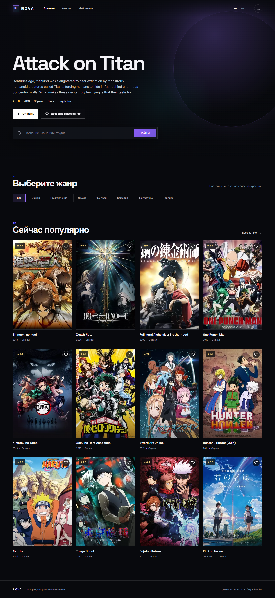

# NOVA Media Catalog


NOVA is a bilingual anime catalog focused on external API integration and resilient frontend states. It combines Jikan API data with normalized internal models, search, pagination, details, favorites, and an automatic mock fallback when the upstream service is unavailable.

## Live Demo

https://media-library-api-app.vercel.app

## Source Code

https://github.com/Andrey15211/media-library-api-app

## Features

- Popular media spotlight and responsive poster catalog
- Query-based search and genre filtering
- Server-backed pagination and dynamic detail pages
- Browser-persistent favorites
- Loading, error, retry, and empty states
- Jikan response normalization
- Automatic fallback to local mock data
- Keyboard focus and reduced-motion support

## Tech Stack

- Nuxt 3
- Vue 3
- TypeScript
- Tailwind CSS
- Nitro server API routes
- Jikan v4 REST API
- Vitest

## Localization

- RU/EN support: navigation, controls, filters, states, metadata, and SEO copy
- Default language: Russian
- Language switcher: available in the header
- Locale preference: persisted in a cookie and `localStorage`
- Third-party titles and descriptions remain original catalog content

## Screenshots

### Desktop



### Mobile

Planned path: `docs/screenshots/mobile.png`

### RU/EN example

Planned path: `docs/screenshots/localization.png`

Mobile and localization screenshots will be added after final interactive capture.

## Local Development

```bash
npm install
npm run dev
npm run build
```

No API key is required. `NUXT_JIKAN_BASE_URL` is optional and defaults to `https://api.jikan.moe/v4`.

## Deployment

Deployed on Vercel using the Nuxt.js preset. Nitro server endpoints run as Vercel functions, and the local fallback keeps the demo usable during Jikan outages or rate limits.

## What this project demonstrates

- External API consumption and normalization
- Resilient async UI and fallback data
- Fullstack-like Nuxt server routes
- Dynamic routing and local persistence
- Cross-framework frontend adaptability

## Recommended GitHub Topics

`nuxt` `vue` `typescript` `anime-catalog` `jikan-api` `rest-api` `api-integration` `responsive-design` `localization` `vercel`
